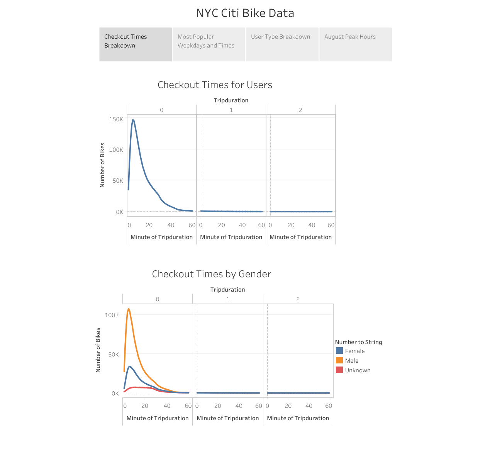
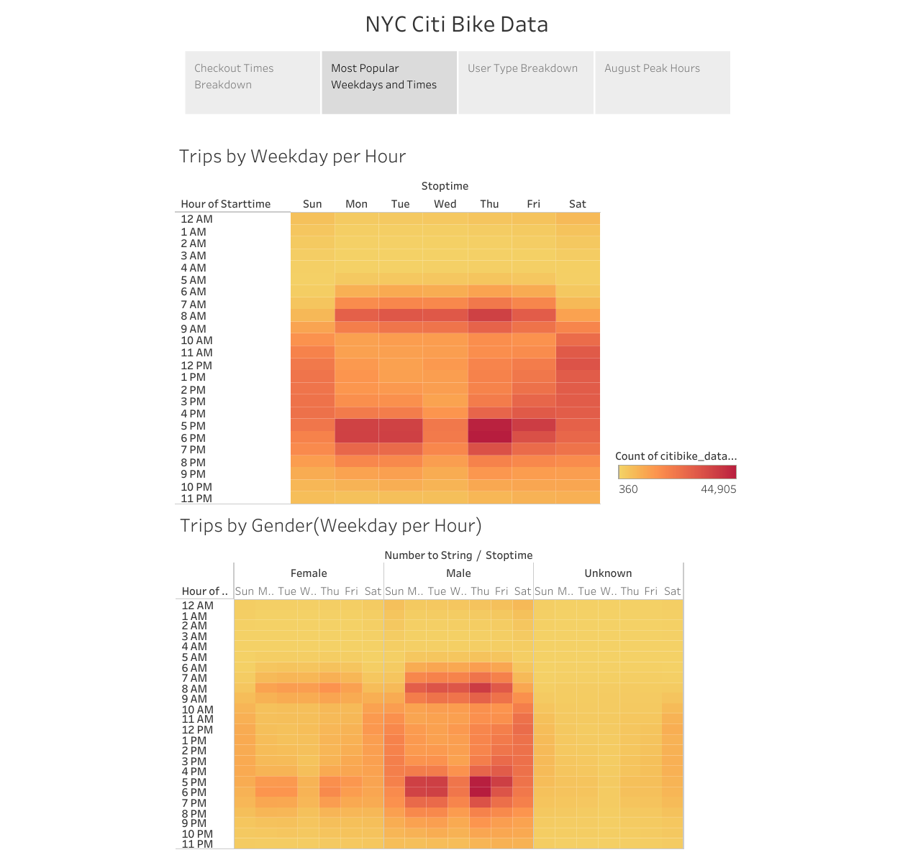
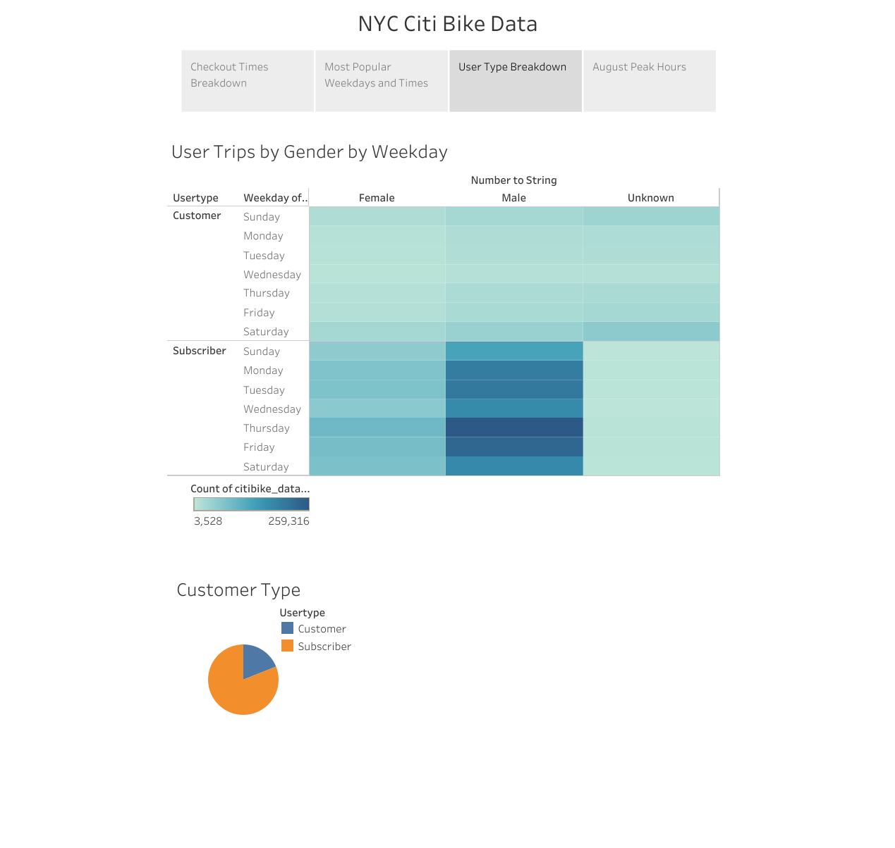
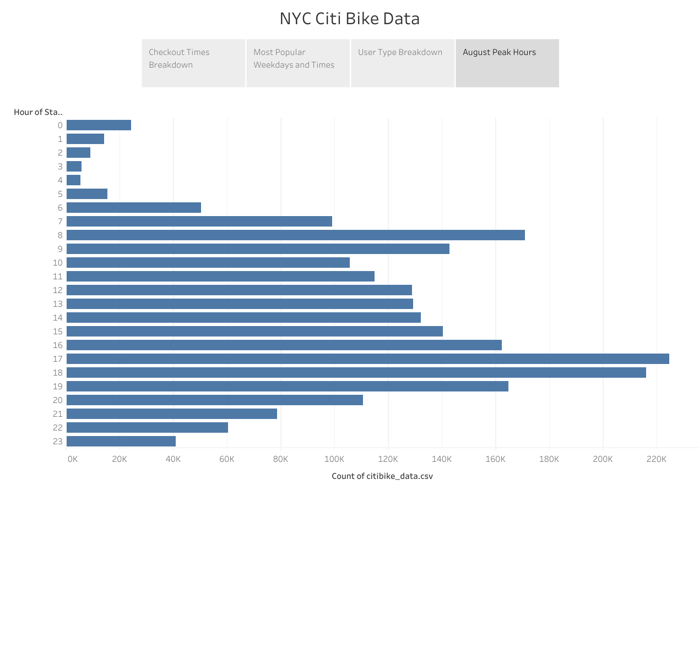

# NYC Citi Bike Analysis
An exploration of Citi Bike usage in New York City
## Overview

This analysis explores the data on bike rentals in NYC for the purpose of determining the viability of starting a bikeshare company in Des Moines. 

## Results

In order to get a comprehensive picture of the data from NYC, several data points are compared including checkout times, duration, usage by gender and usage by subscriber or non-subscriber.

The graphs above show the trip duration times for all bike checkouts. The bottom graph shows trip duration with the added dimension of gender. As you can see, the vast majority of trips last for under 25 minutes or so. Almost no trips last for over an hour, which suggests that the rentals are for the purpose of practical transportation rather than a leisurely ride. The bottom graph also shows that males are checking out rental bikes more than women.

This pair of graphs show the most popular checkout times by days of the week. Once again, the bottom graph shows the same data broken down by gender. It seems apparent that the "hot zones" are from the hours of 8-9am and 5-7pm on weekdays. Checkout times are more evenly distributed in the afternoon for weekend days. As before, men are checking out bikes at higher rates than women. It can be inferred from these heatmaps that a large utility of bike rentals are used for work commutes.

These graphs give us some insight into the type of user that are checking out bikes. On top, we have a similar heatmap to the previous page, with the added category of user type: subscriber or one-time customer. On the bottom, we have a pie chart which displays the share of each user type. Subscribers appear to account for the majority of bike rentals. With the aggregation of these categories, we can see that male subscribers are the most frequent users of Citi Bikes in New York City.

For the last page in our story, we have a horizontal bar chart showing the peak hours for only the month of August, an ideal time for bike rentals. The data here is consistent with the rest of the year. The busiest checkout times are those around a typical work commute, with checkouts leveling off in the late hours of the night and early hours of the morning.

## Summary

A reasonable conclusion from these data is that the majority of bike rentals are used for the purpose of getting to and from work. This is intuitive considering the lack of car ownership in New York City. This should be taken into account when thinking about how bike rentals might be used in Des Moines. With this in mind, it would be desirable to explore the average distance traveled. It may be less practical to get around by bike in Des Moines and commuters may be less keen on using this service for their regular commutes. A look into the age ranges may be desirable as well to determine if the differences in average age between the two cities would be a factor in the amount of rentals.
